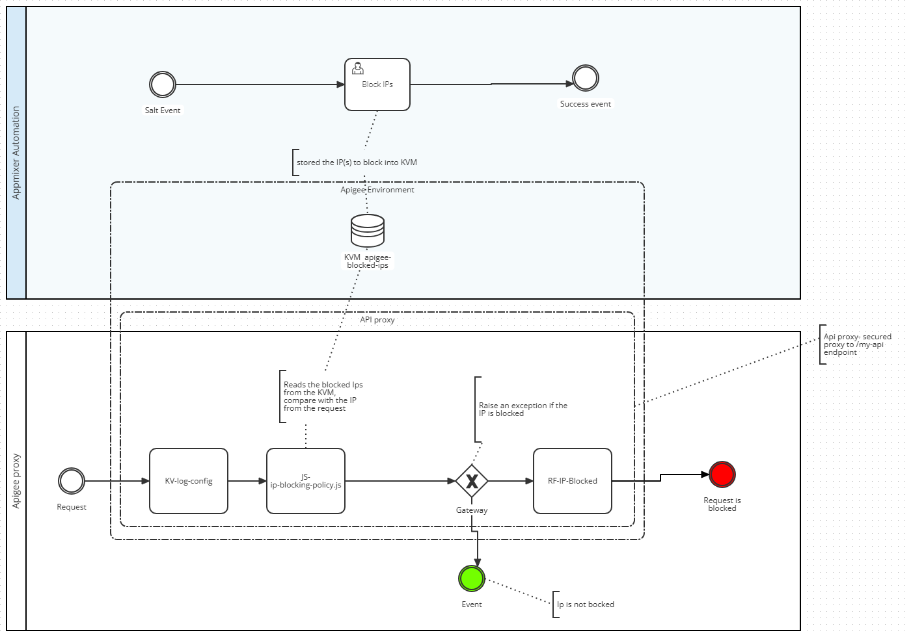

# Architecture Overview

## Overview



## Folder Structure

apigee/  
├── artifacts // Contains artifacts for Shared Flow  
├── core // Core components for Apigee       
└── blocking-ip-shared-flow  // Shared Flow for blocking IPs  


### artifacts/sharedflowbundle

#### policies/
Defines the policies used in the Shared Flow.

##### KV-log-config.xml
Key Value Map Operations policy. It pre-loads the entries from the Key Value Map (KVM) that contains the blocked IPs. This policy is used to retrieve the list of blocked IPs from the KVM and store it in a variable for further processing.

##### JS-ip-blocking-policy.js.xml
Javascript policy for blocking IPs based on the rules defined in the resource file (resources/jsc/ip-blocking-policy.js). This policy is used to check if the incoming request's IP address is in the blocked list and respond accordingly. 

##### RF-IP-Blocked.xml
Raise Fault policy. This policy is used to raise an error when the request is blocked due to the IP address being in the blocked list.


#### build new bundle

```
npm install
npm run build
```
